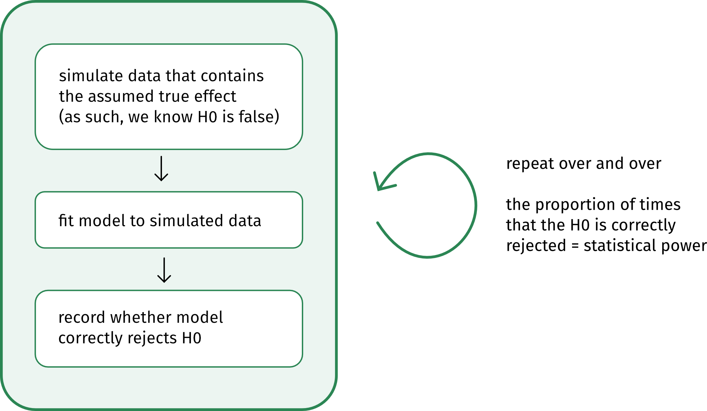
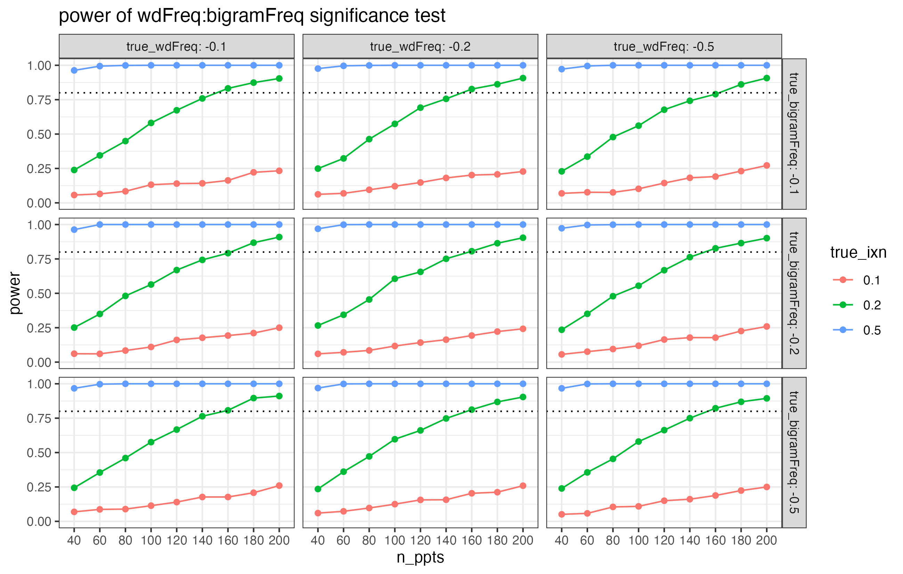

This post covers the power analysis workshop I'm running in Prof. Holly Branigan and Prof. Martin Pickering's lab meeting on 17 March, 2026.

The models we'll look at:

- [Example 1](#ex1): `logRT ~ wdFreq + (wdFreq | ppt_id)`
- [Example 2](#ex2): `logRT ~ wdFreq * bigramFreq + (wdFreq * bigramFreq | ppt_id) + (1 | wd_id)`

```{css echo=FALSE}
div.yellow{ 
    border-radius: 5px; 
    padding: 20px 20px 10px 20px; 
    margin-top: 20px; 
    margin-bottom: 20px; 
    background-color:#FFFBEE !important; 
}
```

# Get set up in R

Load the libraries this workshop will use:

```{r setup, message=F, warning=F}
library(tidyverse)
library(simr)
library(mixedpower)
```


```{r include=F}
theme_set(theme_bw())
theme_update(
  text = element_text(family = "Fira Sans", size = 16),
  panel.grid = element_blank(),
  strip.background = element_blank(),
)
```


If you don't have `mixedpower` installed already, you can get it with the following code.

```{r eval = F}
if(!require("devtools")){
  install.packages("devtools", dependencies = TRUE)
}
devtools::install_github("DejanDraschkow/mixedpower")
```

(`mixedpower` lives on GitHub, not CRAN, so the usual `install.packages()` won't work.)


# Build intuitions

## Why do we care about power?

Short answer: power analyses are useful because they tell us how many experimental participants we should try to recruit.

:::yellow
🧠✨ 
Why do you care? Why were you interested in having this workshop?
:::


## What is statistical power?

For any null hypothesis (H0) that we are trying to test, there are **two possible true states of the world:**

1. In reality, the H0 is true.
1. In reality, the H0 is false.

Assuming we're doing Null Hypothesis Significance Testing, aka NHST, then ideally, these true states of the world would map exactly to the **two possible outcomes of a statistical test:**

1. We fail to reject the H0.
1. We reject the H0.

However, even if the H0 is really truly false, we are (alas!) not guaranteed to reject it.

In other words, **the probability that our test will correctly reject the H0** (that is, that we'll reject the H0 when it really truly is false) is likely going to be less than 100%.
Whatever that probability actually is is our test's **"statistical power".**

:::{.callout-tip collapse = 'true'}
#### How decisions about H0 map to truth of H0

{fig-align="center"}

:::


Statistical power depends on three values:

1. our accepted alpha level (aka our false positive rate, aka our Type I error rate, aka the probability of rejecting the H0 when it is actually true);
1. the true size of the effect out there in reality; and
1. the number of observations we have gathered.

**On alpha:** 
The smaller your alpha, the lower your statistical power, because rejecting the H0 becomes more difficult.
In Psychology and sister disciplines, we usually set our alpha at 5%.
This means that we accept the risk that we'll be incorrectly rejecting the H0 5% of the time.

**On true effect size:** 
The larger the true effect size, the more likely a test is to correctly detect it.
Of course, we don't know the true effect size—that's why we're doing stats about it!
But we can use previous research and our expert judgements to make some educated guesses about what kinds of true effect sizes would be reasonable and/or theoretically interesting.

**On number of observations:** The larger your sample, the higher your power. 
The goal of the power analysis is usually to discover how many participants we need for a reasonably-powered study (which we usually say is 80% power).
We'll figure out how many participants we need by simulating a bunch of different sample sizes and looking at the power of each scenario.


## Simulation, you say?

<!-- Yes—we do a priori power analyses (that is, power analyses before the main study is run) by simulating data that contains the effect we are interested in, then fitting a model to that data, and checking whether we  -->

This schematic shows the basic logic behind a simulation-based power analysis:

{fig-align="center"}


## When to run a power analysis?

The best time to run a power analysis is **after piloting your experiment** and **before running the main thing.**
You'll hear this referred to as an "a priori power analysis".

**Why run the pilot first?**
Because pilot data helps us approximate average outcomes as well as how much variability we should expect from which sources.
For example, the pilot will give us the best possible information about how much

- by-participant variability
- by-stimulus variability
- by-whatever-else variability
- residual variability

our actual experimental data will contain.

**Why not run the experiment first and analyse its power after the fact?**
Because if you use your observed effect size as a stand-in for the true effect size, then you'll just end up with a different way of formulating whatever p-value you observed.
So a post-hoc power analysis doesn't actually offer any new information.
(For more detail, see [this blog post by Daniel Lakens](https://daniellakens.blogspot.com/2014/12/observed-power-and-what-to-do-if-your.html).)


# Ex. 1: Start simple(ish) 🌶️ {#ex1}

Imagine you're running a lexical decision task to analyse the effect of a word's frequency on how quickly people identify it as a word in their language.

:::yellow
🧠✨  What kind of effect would you expect to find?
:::

Because many of you said you work with continuous outcomes, our outcome variable will be logged reaction times.
But the same principles apply even if you have a different kind of outcome variable and different model family, e.g., 0/1 data and a binomial family.

And because many of you said you work with categorical predictors, we'll group words into two frequency classes: one for low-frequency words, one for high-frequency words.
(But [Example 2 below](#ex.-2-get-spicier) will also throw in a continuous z-scored predictor.)


All told, our variables for this analysis will be the following:

- `logRT`: logged reaction times (smaller values = faster)
- `wdFreq`: categorical, with two levels: `low`, `high`; varies within participants 
- `ppt_id`: categorical, with one value per participant


## Build up basic power analysis, step by step

Here are the steps we're going to follow:

1. Formulate the model you want to fit.
1. Define how all variables are coded/transformed.
1. Simulate design matrix (aka a big dataframe of all the observed combinations of our variables, not including the outcome).
1. Define parameter values (i.e., the intercept, the variance components, and the true effect size(s) we're interested in simulating).
1. Use all this information to set up a simulation model with `simr::makeLmer()`.
1. Use that model to run the power analysis with `mixedpower::mixedpower()`.

(In the later examples, we'll iterate over a handful of different true effect sizes, to see how the true effect size makes a difference for how many participants we'd need to recruit.
That iteration will bundle steps 5 and 6 together into one.)


### 1. Formulate the model you want to fit

We'll get the most conservative power estimates if the model we use for the power analysis is the maximal model that your data structure permits.
(For more detail on this point, see the [Questions you submitted](#questions-you-submitted) section below.)

Here is the model formula in R syntax:

`logRT ~ wdFreq + (wdFreq | ppt_id)`


If you want to see a mathematical version of this model specification, then you can uncollapse the box below.
Some people find the mathematical specification useful because it specifies all the parameters that we're going to need to define in the next few steps.
But if that doesn't spark joy, then don't worry about it!

:::{.callout-tip collapse = 'true'}
#### For the keen: Mathematical model specification

**In words:**

- Each participant $i$'s log RT equals
  - the intercept $\beta_0$ plus each participant's intercept adjustment $u_{0i}$; plus
  - the slope over `wdFreq` $\beta_1$ plus each participant's slope adjustment $u_{1i}$, all times `wdFreq`; plus
  - some error $\epsilon$.
- The error $\epsilon$ is sampled from a Normal distribution with mean 0 and standard deviation (SD) $\sigma$.
- Each participant's adjustments to intercept $u_{0i}$ and slope $u_{1i}$ are sampled together from a bivariate Normal distribution.
  - The mean of each dimension is 0.
  - The spread of the distribution in each dimension is defined by a variance-covariance matrix with the variance (SD$^2$) of each adjustment on the diagonal and the correlations between those adjustments on the off-diagonals. Here the correlations are assumed to be zero.
  - NB: Because slope and intercept adjustments are uncorrelated in this example, I could also have written them being drawn from two separate univariate Normals, like in the $\epsilon$ line. 
  However, the `simr` code below wants a variance-covariance matrix, even if the correlations are 0, so for consistency, I'm using the bivariate Normal version here to give a reference point for where the `simr` variance-covariance matrix comes from.
  

**In math:**

$$
\begin{align}
\text{logRT}_i &= (\beta_0 + u_{0i}) + (\beta_1 + u_{1i}) \cdot \text{wdFreq} + \epsilon \\
\epsilon &\sim \text{Normal}(0, \sigma) \\
\pmatrix{u_{0i} \\ u_{1i}} &\sim \text{Normal}
\begin{bmatrix}
\pmatrix{0 \\ 0},
\pmatrix{\sigma_{u_{0i}}^2 & 0 \\ 0 & \sigma_{u_{1i}}^2}
\end{bmatrix}
\\
\end{align}
$$


**Parameter glossary:**

- $i$ indexes participants
- $\beta_0$ is the fixed intercept
- $u_{0i}$ is the by-participant adjustment to fixed intercept
- $\beta_1$ is the fixed slope over `wdFreq`
- $u_{1i}$ is the by-participant adjustment to fixed slope
- $\epsilon$ is the error
- $\sigma$ is the SD of errors
- $\sigma_{u_{0i}}$ is the SD of by-participant intercept adjustment
- $\sigma_{u_{1i}}$ is the SD of by-participant slope adjustment

:::

### 2. Define how all variables are coded/transformed

In order to make a reasonable guess about what values the model parameters might have, we need to know about the kinds of numbers that represent each variable.

- What units/scales do continuous predictors use?
- What contrast coding schemes do categorical predictors use?

We already know that the outcome `logRT` is in **log units,** not ms.
(Logging RTs is important so that residuals are approximately normally distributed.)

Let's say that `wdFreq` will be "sum-coded", which you'll also see called "effect-coded", which you'll also see called "deviation-coded".
Because these words have no meaning anymore, let's just be explicit and say that **`low` will be coded as –0.5 and `high` as +0.5.**

Consequently:

- The intercept will represent the **grand mean log RT.**
  - What's a grand mean? Take the mean log RT of `low` frequency words and the mean log RT of `high` frequency words; the mean of both of those means is the grand mean.
- The slope over `wdFreq` will represent the **change in log RT as we move from `low` to `high`.**

:::yellow
🧠✨ 
Do you think that the `wdFreq` coefficient should have a positive value or a negative value?
:::


### 3. Simulate design matrix

Imagine running a pilot study in which you gather logRT data from ten different participants.
In your design, each participant sees ten words in total: five words from the `low` frequency group of `wdFreq` and five words from the `high` frequency group of `wdFreq`.
After data collection, you'd end up with a dataframe with the following structure:

- a column `ppt_id` containing each participant ID repeated ten times, once per word.
- a column `wdFreq` containing (for each participant) –0.5 repeated five times for the five `low` frequency words, +0.5 repeated five times for the five `high` frequency words; and
- a column `logRT` containing each participant's log reaction time for the given trial.

In this step, we're basically going to generate all columns of this dataframe *except* for the outcome variable (which here is `logRT`).
In stats terms, we're generating the "design matrix".

```{r}
n_ppts        <- 10  # how many participants to simulate?
                     # (this number should match your pilot)

n_wds_per_ppt <- 10  # how many words does each ppt see?
                     # (this number should match your pilot + experiment)

simdat1 <- tibble(
  ppt_id = rep(1:n_ppts, each = n_wds_per_ppt),
  wdFreq = rep(
    c(
      rep(-0.5, n_wds_per_ppt/2), 
      rep(0.5, n_wds_per_ppt/2)
    ), n_ppts
  )
)

simdat1 |> head(20)
```

<!-- There are [so many R packages out there](https://www.scienceverse.org/faux/#other-simulation-packages) that will help you simulate data. -->

(There are [so many different ways](https://www.scienceverse.org/faux/#other-simulation-packages) to generate this kind of data in R.
I leave coding different experimental designs as a challenge for the reader 😊)


### 4. Define parameter values

We want our power analysis to use our best guesses about the true values of all the model's parameters.
So, here's where we use pilot data to make our best guess about (i) the model's intercept and (ii) the variability we might expect to see in the data.

We will also use our expert judgement to define (iii) the smallest effect size that we'd consider theoretically interesting—a key step of the power analysis!


#### (i) Intercept

Because our predictor is coded with $\pm$ 0.5 (i.e., it is centered on zero), the model's intercept represents the grand mean log RT.


Imagine we observed the following (unrealistically lovely and round) estimate from our pilot data:

```{r}
grand_mean <- 6.5
```

For reference, 6.5 log units maps to

```{r}
exp(6.5)
```

milliseconds.


#### (ii) Variance components

Our model, `logRT ~ wdFreq + (wdFreq | ppt_id)`, is modelling three sources of variability:

- by-participant adjustments to the intercept;
- by-participant adjustments to the slope; and
- residual error.

For the power analysis, we need to define how variable we expect each of these three parameters to be.
Specifically, we need to give the standard deviation (SD) of each one.

Let's imagine that a pilot study gave us the following (unrealistically lovely and round) values:

```{r}
sd_int_by_ppt <- 1
sd_slp_by_ppt <- 0.5
sd_resid      <- 0.5
```


#### (iii) Effect of interest

Our research question asks how differences in `wdFreq` are associated with differences in `logRT`.
So the parameter whose significance we are testing is the coefficient estimated for `wdFreq`.

:::yellow
🧠✨ 
Imagine we find a difference between low-frequency and high-frequency words of 0.001 log units.
In other words, **an effect size of 0.001 log units.**

Even if we were able to reject the H0 that this parameter is equal to zero, is a difference of that magnitude **theoretically interesting?**

What about:

- 0.01 log units?
- 0.1 log units?
- 1 log unit?
- 10 log units?
- 100 log units?
:::


:::{.callout-tip collapse = 'true'}
#### Translating effect sizes between log units and ms

The log transformation is non-linear, **so an effect size in log units will translate to different effect sizes in ms**, depending on the original values we're comparing.

For example, imagine an effect size of 1 log unit.

If that effect size is the difference between 3 log units and 4 log units, then it maps to a difference in RT in ms of:

```{r}
exp(4) - exp(3)
```

But if that same one-unit effect size is the difference between 5 log units and 6 log units, then suddenly it maps to a difference in RT in ms of:

```{r}
exp(6) - exp(5)
```


Here is a visualisation of how the same difference between log units can map to very different differences on the ms scale:

```{r}
#| code-fold: true

tibble(
  RT    = seq(0:450),
  logRT = log(RT)
) |>
  ggplot(aes(x = RT, y = logRT)) +
  scale_y_continuous(breaks = 0:8, expand = c(0, 0)) +
  scale_x_continuous(expand = c(0, 0)) +
  labs(x = 'RT (ms)', y = 'log RT (log units)') +
  # horiz green
  geom_segment(x = 0, y = 3, xend = exp(3), yend = 3, colour = '#2B8654') +
  geom_segment(x = 0, y = 4, xend = exp(4), yend = 4, colour = '#2B8654') +
  geom_text(
    x = 5,
    y = 4-.2,
    colour = '#2B8654', 
    family = 'Fira Sans',
    label = paste0('diff: 1'),
    hjust = 0
  ) +
  # vert green
  geom_segment(x = exp(3), y = 0, xend = exp(3), yend = 3, colour = '#2B8654') +
  geom_segment(x = exp(4), y = 0, xend = exp(4), yend = 4, colour = '#2B8654') +
  geom_text(
    x = exp(3) + (exp(4)-exp(3))/2, 
    y = 1,
    colour = '#2B8654', 
    family = 'Fira Sans',
    label = paste0('diff:\n ', round(exp(4) - exp(3)), 'ms')
  ) +
  # horiz pink
  geom_segment(x = 0, y = 5, xend = exp(5), yend = 5, colour = '#FF6393') +
  geom_segment(x = 0, y = 6, xend = exp(6), yend = 6, colour = '#FF6393') +
  geom_text(
    x = 5,
    y = 6-.2,
    colour = '#FF6393', 
    family = 'Fira Sans',
    label = paste0('diff: 1'),
    hjust = 0
  ) +
  # vert pink
  geom_segment(x = exp(5), y = 0, xend = exp(5), yend = 5, colour = '#FF6D9A') +
  geom_segment(x = exp(6), y = 0, xend = exp(6), yend = 6, colour = '#FF6D9A') +
  geom_text(
    x = exp(5) + (exp(6)-exp(5))/2, 
    y = 1,
    colour = '#FF6D9A', 
    family = 'Fira Sans',
    label = paste0('diff: ', round(exp(6) - exp(5)), 'ms')
  ) +
  geom_point() +
  NULL
```

So, given that effect sizes in log units can translate to so many different effect sizes in ms, **how do we know what effect sizes in log units are reasonable?**

- Good: Look at previous literature.
- Better: Use your pilot data to estimate what magnitude of values you're comparing.

:::


Here's where we use our expert judgement, along with results from prior literature, to decide on the *smallest* effect size that would be theoretically interesting.
This value is often abbreviated as SESOI, for "Smallest Effect Size Of Interest".

Let's imagine for now that our SESOI is a change of 0.2 log units.
We'll represent this value as negative, because we expect log RT to get smaller (i.e., faster) when we move from low-frequency words (coded as –0.5) to high-frequency words (coded as +0.5).

```{r}
sesoi <- -0.2
```

The power analysis that follows assumes that the true effect out there in reality is –0.2 log units.
**This is how we know the H0 in our simulation is false: we've declared that it is false, because we have given this parameter a value different from zero.**


([Later on](#iterate-over-different-effect-sizes) we will also check a couple other possible true effect sizes, both smaller and larger, so that we understand the power properties of our design more completely.)


### 5. Set up simulation model with `makeLmer()`

In Step 6 below, we'll use `mixedpower()` to actually run the power analysis proper.
One of the inputs that `mixedpower()` wants is a linear model fit to some data.

We haven't simulated any outcome data—we've just defined a design matrix and some parameter values.
And that is fine!
We can use `simr`'s function `makeLmer()` to create a model object using all this information we've specified above.
With `simr` in our back pocket, we don't actually need to simulate any log RTs ourselves 😊

```{r}
simmod1 <- makeLmer(
  formula = logRT ~ wdFreq + (1 + wdFreq | ppt_id),
  
  ## fixed effect coefs: intercept, wdFreq slope
  fixef = c(grand_mean, sesoi),
  
  ## residual SD
  sigma = sd_resid,
  
  ## variance-covariance matrix for random effects
  VarCorr = matrix(
    c(sd_int_by_ppt^2, 0, 0, sd_slp_by_ppt^2),
    nrow=2,
    byrow = T),
  
  ## design matrix
  data = simdat1
)

summary(simmod1)
```

(Make sure all the numbers you defined are showing up where you expected them to be!)


### 6. Run power analysis with `mixedpower()`

All that's left is to decide how many different participants counts we want to simulate.
It's good to range from "absolutely utopian in the year 1985" to "we do not have this much money".
If counts are unrealistic at both extremes, then all our bases are covered:

```{r}
n_ppts_to_sim <- c(40, 60, 80, 100, 120)
```


**And now we run the power analysis!**

- Remember that our H0 is that the association between `wdFreq` and `logRT` is zero.
- We know that the H0 is false, because we defined the association between `wdFreq` and `logRT` to be not zero, but rather –0.2 log units.
- So, given that the H0 is false, how often does our design correctly reject the H0 with different numbers of participants? 
**In other words, what is our design's power at different participant counts?**

Let's find out:

```{r power1, cache=T, results='hide'}
power1 <- mixedpower(
  model = simmod1, 
  data = simdat1,
  fixed_effects = c("wdFreq"),
  simvar = "ppt_id",
  steps = n_ppts_to_sim,
  critical_value = 2, 
  n_sim = 1000
)
```

```{r}
power1
```

- With 40 participants, power is 55.7%.
- With 60 participants, power is 72.9%.
- With 80 participants, power is 84.8%.
- With 100 participants, power is 91.8%.
- With 120 participants, power is 96.6%.

:::yellow
🧠✨ 
How many participants would you aim to recruit?
:::


:::{.callout-tip collapse = 'true'}
#### R tips for `mixedpower()`

- ⌛️ It can take several seconds, even minutes, for these simulations to run, especially when iterating over different parameter values like we will below.
- 🎲 Expect some slightly different values from mine. Usually I'd set a seed for a probabilistic process like this, but setting the seed seems to have no effect on `mixedpower()`, so results will be a little different every time 🙃
- 🗃️  For the sake of internal reproducibility at least, if you're using R markdown, write `cache = T` in the header of the code chunk containing the call to `mixedpower()`. 
With `cache = T`, the code chunk's output will be stored, so that the code doesn't need to be re-run every time you render the document.
- 🖨️ While it's running, `mixedpower()` prints out a ton of status updates.
To suppress these in the rendered document, update the code chunk's header to also include `results = 'hide'`.

:::


## Iterate over different effect sizes

To understand our design's power properties, it's usually useful in practice to simulate a few different effect sizes, not just the SESOI.
Here we'll look at values on either side of our SESOI.

```{r cache=T}
effects_to_sim <- c(-0.1, -0.2, -0.5)
```


One way to code this is to use a for loop (R superbrains, avert your eyes).

The code below takes Steps 5 and 6 and runs them three times.
Each time, the `makeLmer()` model defines a different true effect size based on the `effects_to_sim` we defined above.

```{r power-iter1, cache = T, results = 'hide'}
# set up accumulator to save the data from each iteration
# (we'll add on a new row each time)
power_accumulator1 <- tibble(
 '40' = NA, 
 '60' = NA, 
 '80' = NA, 
 '100' = NA, 
 '120' = NA,
 'mode' = NA,
 'effect' = NA,
 'true_effect_size' = NA,
)[0,]

# iterate!
for(curr_effect in effects_to_sim){
  
  # set up the model with the current param estims 
  curr_model <- makeLmer(
    formula = logRT ~ wdFreq + (1 + wdFreq | ppt_id),
    fixef = c(grand_mean, curr_effect),
    sigma = sd_resid,
    VarCorr = matrix(
      c(sd_int_by_ppt^2, 0, 0, sd_slp_by_ppt^2),
      nrow = 2, 
      byrow = T
    ),
    data = simdat1
  )
  
  # get power estims
  curr_power <- mixedpower(
    model = curr_model, 
    data = simdat1,
    fixed_effects = c("wdFreq"),
    simvar = "ppt_id", 
    steps = n_ppts_to_sim,
    critical_value = 2, 
    n_sim = 1000,
  )
  
  # add current iteration's parameters to df
  curr_power$true_effect_size  <- curr_effect
  
  # add to accumulator
  power_accumulator1 <- rbind(power_accumulator1, curr_power)
  
}
```

```{r}
power_accumulator1
```


After wrangling this data a bit, we can also make a nice little plot that shows power curves for our three different effect sizes:

```{r fig.align = "center"}
power_accumulator1 |>
  
  # make df tall, not wide
  pivot_longer(
    cols = as.character(n_ppts_to_sim),
    names_to = 'n_ppts',
    values_to = 'power'
  ) |>
  
  # make things into factors so they plot nicely
  mutate(
    true_effect_size = factor(true_effect_size, levels = effects_to_sim),
    n_ppts = factor(n_ppts, levels = n_ppts_to_sim)
  ) |>
  
  # plot!
  ggplot(aes(x = n_ppts, y = power, colour = true_effect_size)) +
  geom_hline(yintercept = 0.8, linetype = 'dotted') +
  geom_point() +
  geom_line(aes(group = true_effect_size)) +
  ylim(0, 1) +
  labs(
    y = 'Power (% times H0 correctly rejected)',
    x = 'How many participants?',
    colour = 'True effect size'
  )
```


:::yellow
🧠✨ 
Imagine the true effect size is –0.1.
How many participants would you aim to recruit?
:::

And that's a power analysis!

<br>

# Ex. 2: Get spicier 🌶🌶 {#ex2}

Usually our linear models are more complex than the model in Example 1.
We often want to model interactions between predictors, and we often have to account for variability from multiple sources (e.g., participant-level and stimulus-level).
This section illustrates the same process shown above for a more complex model.

Imagine we're still looking at log RTs in a lexical decision task.
We still have our categorical predictor `wdFreq`, but now we'll also incorporate the mean frequency of individual *bigrams* within each word.
So, we're adding in a continuous predictor, `bigramFreq`, and we'll also allow it to interact with `wdFreq`.

Our variables for this analysis will be the following:

- `logRT`: logged reaction times (smaller values = faster)
- `wdFreq`: categorical, with two levels: `low`, `high`
  - varies within participants
  - varies between words
- `bigramFreq`: continuous, mean bigram frequency within each word, z-scored
  - varies within participants
  - varies between words
- `ppt_id`: categorical, one value per participant
- `wd_id`: categorical, one value per word


Our question is: **Does bigram frequency have a different effect on log RTs for high-frequency words and low-frequency words?**

Our hypothesis might be:

- High-frequency words will have fast RTs across the board, maybe even slightly faster when bigram frequency is also high.
- But for low-frequency words, bigram frequency will make a big difference: RTs will be slower when bigram frequency is lower, and faster when bigram frequency is higher.

(Is this actually true? idk!)

## 1. Formulate the model

The maximal model is the following:

`logRT ~ wdFreq * bigramFreq + (wdFreq * bigramFreq | ppt_id) + (1 | wd_id)`


:::{.callout-tip collapse = 'true'}
#### For the keen: Mathematical model specification

**In words:**

- Each participant $i$'s and word $j$'s log RT equals
  - the intercept $\beta_0$ plus each participant's intercept adjustment $u_{0i}$ plus eaach word's intercept adjustment $w_{0j}$; plus
  - the slope over `wdFreq` $\beta_1$ plus each participant's slope adjustment $u_{1i}$, all times `wdFreq`; plus
  - the slope over `bigramFreq` $\beta_2$ plus each participant's slope adjustment $u_{2i}$, all times `bigramFreq`; plus
  - the slope over `wdFreq:bigramFreq` $\beta_3$ plus each participant's interaction adjustment $u_{3i}$, all times `wdFreq` times `bigramFreq`; plus
  - some error $\epsilon$.
- The error $\epsilon$ is sampled from a Normal distribution with mean 0 and standard deviation (SD) $\sigma$.
- Each participant's adjustments to intercept $u_{0i}$, slopes $u_{1i}$ and $u_{2i}$, and interaction term $u_{3i}$, are sampled together from a multivariate Normal distribution.
  - The mean of each dimension is 0.
  - The spread of the distribution in each dimension is defined by a variance-covariance matrix with the variance (SD$^2$) of each adjustment on the diagonal and the correlations between those adjustments on the off-diagonals. Here the correlations are assumed to be zero.
- Each word's adjustment to the intercept $w_{0j}$ is sampled from a Normal distribution with mean 0 and standard deviation $\sigma_{w_{0j}}$.

**In math:**

$$
\begin{align}
\text{logRT}_{ij} =~& (\beta_0 + u_{0i} + w_{0j}) ~ +  \\
&  (\beta_1 + u_{1i}) \cdot \text{wdFreq} ~ +  \\
&  (\beta_2 + u_{2i}) \cdot \text{bigramFreq} ~ +  \\
&  (\beta_3 + u_{3i}) \cdot  \text{wdFreq} \cdot \text{bigramFreq} + \epsilon \\[.5em]
\epsilon \sim~& \text{Normal}(0, \sigma) \\[.3em]
\pmatrix{u_{0i} \\ u_{1i} \\ u_{2i} \\ u_{3i}} \sim~& \text{Normal}
\begin{bmatrix}
\pmatrix{0 \\ 0 \\ 0 \\ 0},
\pmatrix{
  \sigma_{u_{0i}}^2 & 0 & 0 & 0\\ 
  0 & \sigma_{u_{1i}}^2 & 0 & 0\\
  0& 0 & \sigma_{u_{2i}}^2  & 0\\
  0 & 0 & 0 & \sigma_{u_{3i}}^2\\
  }
\end{bmatrix}
\\
w_{0j} \sim~& \text{Normal}(0, \sigma_{w_{0j}})
\end{align}
$$


**Parameter glossary:**

- $i$ indexes participants
- $j$ indexes words
- $\beta_0$ is the intercept
- $u_{0i}$ is the by-participant adjustment to intercept
- $w_{0j}$ is the by-word adjustment to intercept
- $\beta_1$ is the slope over `wdFreq`
- $u_{1i}$ is the by-participant adjustment to slope over `wdFreq`
- $\beta_2$ is the slope over `bigramFreq`
- $u_{2i}$ is the by-participant adjustment to slope over `bigramFreq`
- $\beta_3$ is the interaction term between `wdFreq` and `bigramFreq`, i.e., how much the effect of one predictor changes with a change in the value of the other.
- $u_{3i}$ is the by-participant adjustment to the interaction term
- $\epsilon$ is the error
- $\sigma$ is the SD of errors
- $\sigma_{u_{0i}}$ is the SD of by-participant intercept adjustment
- $\sigma_{u_{1i}}$ is the SD of by-participant slope adjustment to `wdFreq`
- $\sigma_{u_{2i}}$ is the SD of by-participant slope adjustment to `bigramFreq`
- $\sigma_{u_{3i}}$ is the SD of by-participant interaction adjustment
- $\sigma_{w_{0j}}$ is the SD of by-word intercept adjustment
:::

## 2. Define variable coding/transformation

- `wdFreq`: 
  - As in Example 1, `low` frequency is coded as –0.5, `high` frequency as +0.5.
  - The `wdFreq` parameter gives the effect of moving from `low` to `high` when `bigramFreq` = 0.
- `bigramFreq`: 
  - The mean frequency of bigrams in each word, z-scored so that the mean is 0 and SD is 1. (Using z-scores makes simulating data super easy!)
  - The `bigramFreq` parameter gives the effect of moving from mean bigram frequency to one SD above the mean for "average" `wdFreq`.
- `Intercept`: 
  - Because both of the predictors are centered on 0, the intercept still represents the grand mean log RT.


## 3. Simulate design matrix

```{r}
n_ppts        <- 10  # same as in your pilot
n_wds_per_ppt <- 10  # same as in your pilot + experiment

set.seed(1)
simdat2 <- tibble(
  ppt_id = rep(1:n_ppts, each = n_wds_per_ppt),
  wd_id  = rep(1:n_wds_per_ppt, n_ppts),
  wdFreq = rep(
    c(
      rep(-0.5, n_wds_per_ppt/2), 
      rep(0.5, n_wds_per_ppt/2)
    ), n_ppts
  ),
  bigramFreq = rep(rnorm(n_wds_per_ppt, mean = 0, sd = 1), n_ppts)
)

simdat2 |> head(20)
```


## 4. Define parameter values

### (i) Grand mean

Let's assume we've run a pilot study which tells us that the grand mean log RT is, again, 6.5 log units.

```{r}
grand_mean <- 6.5
```


### (ii) Variance components

Let's also assume that our pilot study has given us the following SDs for all the sources of variability in our new model:

- by-participant adjustments to the intercept;
- by-participant adjustments to the slope of `wdFreq`;
- by-participant adjustments to the slope of `bigramFreq`;
- by-participant adjustments to the interaction between `wdFreq` and `bigramFreq`;
- by-word adjustments to the intercept; and
- residual error.

```{r}
sd_int_by_ppt <- 1.5
sd_wdF_by_ppt <- 0.5
sd_bgF_by_ppt <- 0.5
sd_ixn_by_ppt <- 0.5
sd_int_by_wd  <- 0.8
sd_resid      <- 0.5
```

At this point, let's also generate the variance-covariance matrix that `makeLmer()` will demand for the by-participant adjustments.
(In real life, you would just extract this from the model fit to your pilot data; just look for the label `VarCorr` among the model's components.)

```{r}
vcov_by_ppt <- matrix(data = 0, nrow = 4, ncol = 4)
diag(vcov_by_ppt) <- c(
  sd_int_by_ppt^2,
  sd_wdF_by_ppt^2,
  sd_bgF_by_ppt^2,
  sd_ixn_by_ppt^2
)
vcov_by_ppt
```

Each adjustment's variance (SD$^2$) is on the diagonal, and the zeroes on the off-diagonals state that we're assuming that none of these adjustments are correlated with any other ones.


### (iii) Effects of interest

This more complex model has three fixed effects: `wdFreq`, `bigramFreq`, and their interaction.
Do we need to simulate different true effect sizes for all of them?

Let's think about the question we're investigating:

> Does bigram frequency have a different effect on log RTs for high-frequency words and low-frequency words?

**That question can only be answered by looking at the interaction term.**
And so our power analysis will focus on the interaction term too.

Here's a fun fact that makes our lives easier: 
**the power properties of the interaction term don't seem to depend on the interacting predictors having specific values.**
This means that we don't need to simulate tons of combinations of different effects for `wdFreq` and `bigramFreq`.
We can just set them to some constant value and focus our computation on varying the size of the true interaction parameter, because no matter what value the interacting predictors have, the power properties of the interaction term will be the same.

:::{.callout-tip collapse = 'true'}
#### Don't believe me? Just plot

Here are some plots from a related power analysis (but the results are different than what we'll get below!).
<!-- This was from a development version in which I mistakenly simulated bigramFreq as within-word and not between-word oops! Cool to see the power consequences of that though! -->



The facets in this plot show different combinations of true effect sizes for `wdFreq` and `bigramFreq`.
But in every single facet, the overall pattern is the same.
What this suggests is that the power properties of the interaction term are unaffected by the values of the interacting predictors.
:::

Let's set `wdFreq` to –0.2 again.
And let's set `bigramFreq` to –0.1.
(Imagine that those are principled choices, based on pilots and previous literature!)

```{r}
wdFreq_effect     <- -0.2
bigramFreq_effect <- -0.1
```


Now, the interaction...

Interactions are tricky to reason about at the best of times, and I find them extra unintuitive when predictors are centered.
I used a little simulation-based trick to determine that, if our hypothesis is borne out, the interaction term should be positive (see the dropdown box below for details).

:::{.callout-tip collapse = 'true'}
#### How did I find the sign for the interaction term?

I created a dataframe containing a basic constellation of mean log RTs that our hypothesis predicts.

```{r fig.align="center"}
simmeans2 <- tibble(
  wdFreq = c(-0.5, -0.5, 0.5, 0.5),
  bigramFreq = c(-1, 1, -1, 1),
  logRT = c(7, 6, 6, 5.8)
)

simmeans2 |>
  ggplot(aes(x = bigramFreq, y = logRT, colour = factor(wdFreq))) +
  geom_point() +
  geom_line() 
```

Then I fit a simple linear model to this data.
It can't estimate any error, obviously, because the data contains none—but it will fit lines to the four data points provided.

```{r}
summary(lm(logRT ~ wdFreq * bigramFreq, data = simmeans2))
```

This model summary tells me that if the data comes out looking the way we hypothesise, both conditional effects are negative and the interaction term is positive.

(You could also use this trick to work out a reasonable SESOI for the interaction term!)

:::

Let's imagine that the interaction term's SESOI is 0.2 (the simulation-based trick from the dropdown box can help nail down this actual value too).
And to better understand the power properties of the design, let's include a range of values on either side.

```{r}
ixns_to_sim <- c(0.05, 0.1, 0.2, 0.5, 1)
```


## 5/6. Run power analysis, iterating over parameter values

We'll simulate a greater range of participant counts this time.

```{r}
n_ppts_to_sim2 <- c(40, 60, 80, 100, 120, 140, 160, 180, 200)
```


Here's the code to run the simulation! (For me, it takes 10–15 minutes to run.)

```{r poweriter2, cache = T, results = 'hide'}
# define the accumulator 
# (we'll add a new row on each time)
power_accumulator2 <- tibble(
 '40' = NA, 
 '60' = NA, 
 '80' = NA,
 '100' = NA,
 '120' = NA,
 '140' = NA,
 '160' = NA,
 '180' = NA,
 '200' = NA,
 'mode' = NA,
 'effect' = NA,
 'true_ixn' = NA,
)[0,]

# iterate!
for(curr_ixn in ixns_to_sim){
  
  # set up the model with the current param estims 
  curr_model <- makeLmer(
    formula = logRT ~ wdFreq * bigramFreq + 
      (1 + wdFreq * bigramFreq | ppt_id) + (1 | wd_id),
    fixef = c(grand_mean, wdFreq_effect, bigramFreq_effect, curr_ixn),
    sigma = sd_resid,
    VarCorr = list(
      # the four-dimension vcov matrix for the by-ppt adjustments
      vcov_by_ppt, 
      # the variance of the by-word intercept adjustment
      sd_int_by_wd^2
    ),
    data = simdat2
  )
  
  # get power estims 
  curr_power <- mixedpower(
    model = curr_model, 
    data = simdat2,
    fixed_effects = c("wdFreq", "bigramFreq"),
    simvar = "ppt_id", 
    steps = n_ppts_to_sim2,
    critical_value = 2, 
    n_sim = 1000
  )
  
  # add current iteration's parameters
  curr_power$true_ixn <- curr_ixn
  
  # add to accumulator
  power_accumulator2 <- rbind(power_accumulator2, curr_power)
  
}
```


```{r}
power_accumulator2 |> kableExtra::kbl()  # unreadable without kable!
```

Notice that we get power estimates for `wdFreq` and `bigramFreq` too, how nice.

I for one can't just look at a grid of numbers and understand what's happening.
So let's plot it.

Let's first wrangle the data into tall format:

```{r}
power2_tall <- power_accumulator2 |>
  pivot_longer(
    cols = as.character(n_ppts_to_sim2),
    names_to = 'n_ppts',
    values_to = 'power'
  ) |>
  mutate(
    n_ppts = factor(n_ppts, levels = n_ppts_to_sim2),
    true_ixn = factor(true_ixn, levels = ixns_to_sim)
  )

power2_tall |> head()
```


And now let's plot!

```{r}
power2_tall |>
  filter(effect == 'wdFreq:bigramFreq') |>
  mutate(true_ixn = factor(true_ixn)) |>
  ggplot(aes(x = n_ppts, y = power, colour = true_ixn)) +
  geom_point() +
  geom_line(aes(group = true_ixn)) +
  ylim(0, 1) +
  geom_hline(yintercept = 0.8, linetype = 'dotted') +
  labs(
    title = 'power of wdFreq:bigramFreq'
  ) +
  NULL
```

Oof!

:::yellow
🧠✨
What does this power analysis tell us about the power of our interaction term?
:::


:::{.callout-tip collapse='true'}
#### Power plots for `wdFreq` and `bigramFreq`

Here are the analogous plots showing the power of the other two fixed effects:

```{r fig.align="center", fig.height = 4, fig.width = 8}
library(patchwork)

p_wdF <- power2_tall |>
  filter(effect == 'wdFreq') |>
  mutate(true_ixn = factor(true_ixn)) |>
  ggplot(aes(x = n_ppts, y = power, colour = true_ixn)) +
  geom_point() +
  geom_line(aes(group = true_ixn)) +
  # facet_grid(true_bigramFreq ~ true_wdFreq, labeller = label_both) +
  ylim(0, 1) +
  geom_hline(yintercept = 0.8, linetype = 'dotted') +
  labs(
    title = 'power of wdFreq'
  ) +
  NULL

p_bgF <- power2_tall |>
  filter(effect == 'bigramFreq') |>
  mutate(true_ixn = factor(true_ixn)) |>
  ggplot(aes(x = n_ppts, y = power, colour = true_ixn)) +
  geom_point() +
  geom_line(aes(group = true_ixn)) +
  ylim(0, 1) +
  geom_hline(yintercept = 0.8, linetype = 'dotted') +
  labs(
    title = 'power of bigramFreq'
  ) +
  NULL

p_wdF + p_bgF + plot_layout(guides = 'collect')
```

Assuming the true effect sizes we set above, these parameters are really low-powered.
Arguably though, if our hypothesis doesn't hinge on rejecting the H0 for these parameters, then maybe this is okay?
What's more important is the power of our interaction term (which unfortunately is also a little dismal...).

Also, notice how the value of the interaction term doesn't really make a difference for the power of these effects.
:::


# Questions you submitted

:::{.callout-note collapse = 'true'}
#### How would you report and describe a power analysis (in a paper)?

- Different folks have different styles.
- I would keep the body of the paper streamlined and only go into greater detail in the appendix/supplementary materials/OSF project/whatever extra bonus thing.
- For example, in the body of the paper, I might write something like

> We aimed to collect analysable data from [N] participants, because our a priori power analysis indicated that with [N] participants, we could identify a true effect of size [X] with 80% power (see Appendix A).
We recruited a total of [N+x] participants to account for attrition, exclusion, etc., and ended up analysing data from [N–y] participants.

- and then in Appendix A, I'd include a prose description of the process and plots like the ones above. 
- And if you already share your analysis code online, then definitely share the power analysis code too.
:::


:::{.callout-note collapse = 'true'}
#### How do you decide what kind of model to run for simulating the data for power analysis? What if the ideal model does not converge? / Could we discuss [...] min vs max model construction?

- I recommend using the maximal model for the power analysis, even if you ultimately can't fit that model to your real data because of convergence issues etc.
  - Why use the maximal model? Because maximal models are the most conservative possible model, and they have lower statistical power compared to simpler models (see [Matuschek et al., 2017](https://www.sciencedirect.com/science/article/pii/S0749596X17300013)).
  - In other words, the maximal model will give you a larger estimate of how many participants you need to have a well-powered statistical test than a simpler model would.
- So even if you have convergence issues in your real model and need to simplify, then as long as you you collected the amount of data that makes the maximal model well-powered, your simpler model should be even more well-powered.
:::

:::{.callout-note collapse = 'true'}
#### Could we discuss when to do model comparisons and when to do just summaries to interpret what has a significant effect?
	
- For me, this choice really depends on the research question/hypothesis that you're testing.
  - If your research question can best be answered by finding out whether one model is a significant improvement over the other, then model comparisons are the way to go; e.g.,
    - "Is X a useful predictor of Y?"
    - "Does Z explain a significant amount of variance in Y, over and above the variance explained by X?"
  - If your research question can best be answered by finding out whether some model parameter is significantly different from zero, then parameter testing is the way to go; e.g.,
    - "Is the grand mean of Y significantly different from zero?"
    - "Is a change in X significantly associated with a change in Y?"
- I haven't done simulation-based power analyses for model comparison before, but I imagine the same principles should hold:
  - simulate data that you declare to represent the real world;
  - fit both models to that data and make a model comparison decision;
  - do those steps a bunch of times and see what proportion of the time the model comparison test rejects the H0.

:::


# Additional resources

- [Kumle et al.'s notebook walkthroughs of `mixedpower`](https://lkumle.github.io/power_notebooks/)
- [Video lectures from Shravan Vasishth's fantastic intro stats course](https://vasishth.github.io/IntroductionStatistics/); the four-part lesson 12 is all about simulating data and running power analyses


# Session info

```{r}
#| code-fold: false

sessionInfo()
```
